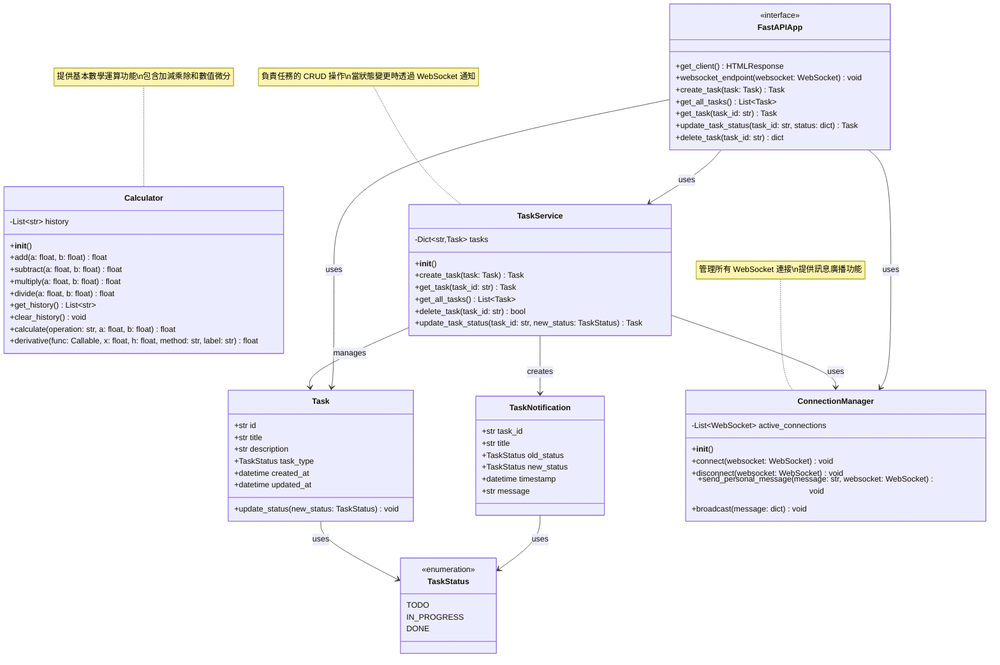

# 專案類別圖

本文件使用 Mermaid 語法描述專案的類別結構圖。

## 系統架構概述

本專案包含兩個主要模組：
1. **計算機模組** - 提供基本數學運算和微分功能
2. **任務管理模組** - 提供任務管理和 WebSocket 即時通知功能

## 類別圖



## 類別說明

### 計算機模組

#### Calculator
計算機類別，提供基本的數學運算功能：
- **屬性**：
  - `history`: 儲存運算歷史記錄
- **方法**：
  - `add()`, `subtract()`, `multiply()`, `divide()`: 基本四則運算
  - `calculate()`: 根據運算符號執行相應的運算
  - `derivative()`: 數值微分，支援中央差分和五點中央差分方法
  - `get_history()`, `clear_history()`: 管理運算歷史

### 任務管理模組

#### TaskStatus (枚舉)
定義任務的三種狀態：
- `TODO`: 待辦事項
- `IN_PROGRESS`: 進行中
- `DONE`: 已完成

#### Task
任務資料模型：
- **屬性**：
  - `id`: 任務唯一識別碼
  - `title`: 任務標題
  - `description`: 任務描述
  - `task_type`: 任務狀態
  - `created_at`: 建立時間
  - `updated_at`: 更新時間
- **方法**：
  - `update_status()`: 更新任務狀態並記錄更新時間

#### TaskNotification
任務通知資料模型，用於 WebSocket 訊息傳遞：
- **屬性**：
  - `task_id`: 任務 ID
  - `title`: 任務標題
  - `old_status`: 舊狀態
  - `new_status`: 新狀態
  - `timestamp`: 通知時間
  - `message`: 通知訊息

#### ConnectionManager
WebSocket 連接管理器，負責管理所有客戶端連接：
- **屬性**：
  - `active_connections`: 所有活躍的 WebSocket 連接列表
- **方法**：
  - `connect()`: 接受新的 WebSocket 連接
  - `disconnect()`: 移除斷開的連接
  - `send_personal_message()`: 發送個人訊息給特定客戶端
  - `broadcast()`: 廣播訊息給所有連接的客戶端

#### TaskService
任務服務類別，提供任務管理的核心業務邏輯：
- **屬性**：
  - `tasks`: 儲存所有任務的字典
- **方法**：
  - `create_task()`: 建立新任務
  - `get_task()`: 取得指定任務
  - `get_all_tasks()`: 取得所有任務
  - `delete_task()`: 刪除任務
  - `update_task_status()`: 更新任務狀態，當狀態為 TO DO、IN PROGRESS 或 DONE 時，自動透過 WebSocket 通知所有客戶端

#### FastAPIApp
FastAPI 應用程式介面，提供 REST API 和 WebSocket 端點：
- **REST API 端點**：
  - `POST /tasks`: 建立任務
  - `GET /tasks`: 取得所有任務
  - `GET /tasks/{task_id}`: 取得指定任務
  - `PUT /tasks/{task_id}/status`: 更新任務狀態（會觸發 WebSocket 通知）
  - `DELETE /tasks/{task_id}`: 刪除任務
- **WebSocket 端點**：
  - `WS /ws`: WebSocket 連接端點，用於接收任務狀態變更通知

## 設計特點

### WebSocket 自動通知機制
當任務狀態變更為以下三種狀態時，系統會自動透過 WebSocket 通知所有連接的客戶端：
1. **TO DO** - 任務被設定為待辦
2. **IN PROGRESS** - 任務開始進行
3. **DONE** - 任務完成

### 通知流程
1. 客戶端呼叫 `PUT /tasks/{task_id}/status` API 更新任務狀態
2. `FastAPIApp` 接收請求並呼叫 `TaskService.update_task_status()`
3. `TaskService` 更新任務狀態並建立 `TaskNotification` 物件
4. `TaskService` 透過 `ConnectionManager.broadcast()` 廣播通知
5. 所有連接的 WebSocket 客戶端即時收到狀態變更通知

## 使用範例

### 啟動伺服器
```bash
python api_server.py
```

### 連接 WebSocket
開啟瀏覽器訪問 `http://localhost:8000` 即可看到測試客戶端介面。

### 透過 API 更新任務狀態
```bash
curl -X PUT "http://localhost:8000/tasks/task-1/status" \
  -H "Content-Type: application/json" \
  -d '{"status": "IN PROGRESS"}'
```

所有連接的 WebSocket 客戶端將會即時收到如下通知：
```json
{
  "type": "task_status_update",
  "data": {
    "task_id": "task-1",
    "title": "範例任務",
    "old_status": "TO DO",
    "new_status": "IN PROGRESS",
    "timestamp": "2025-10-13T12:00:00",
    "message": "任務「範例任務」狀態已從「TO DO」變更為「IN PROGRESS」"
  }
}
```
